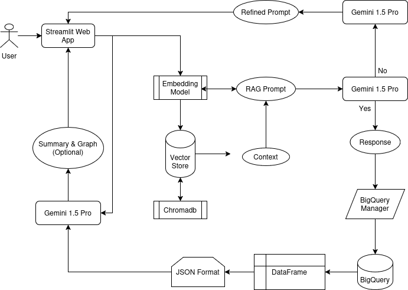
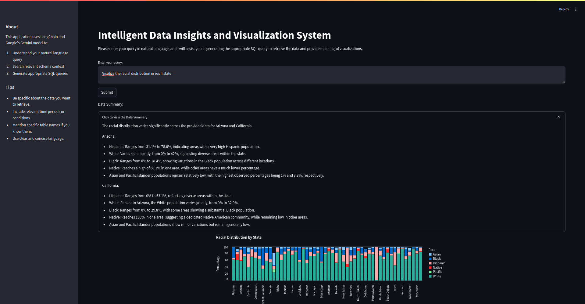

# 📊 LLMHitBigQuery

Welcome to the **LLMHitBigQuery**, an AI-powered web application that enables users to generate SQL queries from natural language input and visualize the results effectively.

## 🚀 Project Overview

This system leverages **LangChain** and **Google's Gemini AI** to:

1. **Understand Natural Language Queries** – Convert user input into meaningful SQL queries.
2. **Search Relevant Schema Context** – Find the best-matching database schema.
3. **Generate Accurate SQL Queries** – Provide optimized SQL queries for execution.
4. **Visualize Results** – Present data in a user-friendly and insightful manner.

---

## Dataset
- The provided dataset represents a university management system with multiple relational tables. Each table contains structured data related to departments, students, instructors, courses, semesters, and financial records. The schema is designed with proper constraints to ensure data integrity.

- **Data Definition Language (DDL):**

Each table is defined with appropriate primary and foreign key constraints to maintain relationships between entities.

You can access the complete database schema and SQL scripts from the following link:
[University Management Database Schema](data/schema.txt)

---

## ⚙️ Features

- **Natural Language to SQL Translation**  
  Generate SQL queries effortlessly based on plain English input.

- **Real-time Data Visualization**  
  View results using interactive charts and tables.

- **Fallback Handling**  
  Intelligent fallback mechanism to provide meaningful responses when queries cannot be generated.

- **User-Friendly Interface**  
  Clean and responsive UI with a mobile-first approach.

---

## 🏗️ Tech Stack

- **WebApp:** Streamlit  
- **AI Model:** LangChain + Google's Gemini  
- **Database:** Google BigQuery  

---

## 🛠️ Installation Guide

Follow the steps below to set up the project locally:

### 1. Clone the Repository

```bash
git https://github.com/faizrazadec/LLMHitBigQuery.git
cd LLMHitBigQuery
```

### 2. Clone the Repository
```bash
python3 -m venv venv
source venv/bin/activate  # On Windows use `venv\Scripts\activate`
```

### 3. Install Dependencies
```
pip install -r requirements.txt
```

### 4. Set Up Environment Variables
Create a .env file and configure the following:
- GCP_PROJECT_ID=
- BIGQUERY_CREDENTIALS_PATH=

### 5. Run the Application
```
streamlit run app.py
```

# 🏛️ Project Flow Diagram


# 📊 Usage Guide

- Enter a natural language query, e.g., "Show me the total sales for Q1 2024."

- Submit the query to generate an SQL statement.

- View results as an interactive table and chart.



---

### ⭐ **Support This Project!**  
If you found this useful, **please consider leaving a star ⭐ on GitHub**!  
It motivates me to keep building more **open-source tools** 🚀  

---
